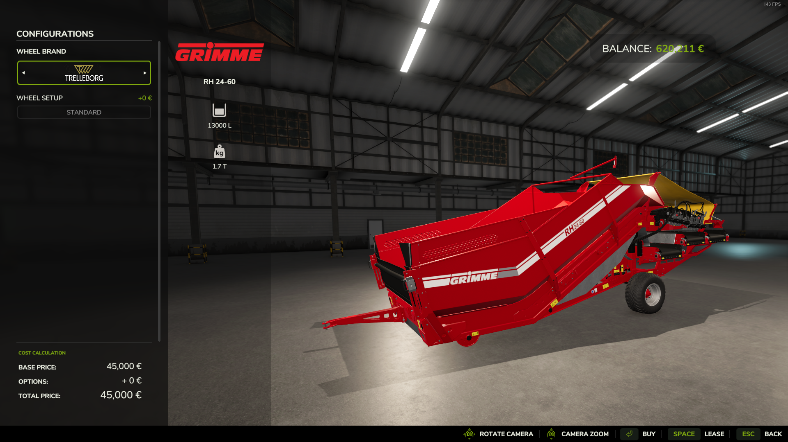
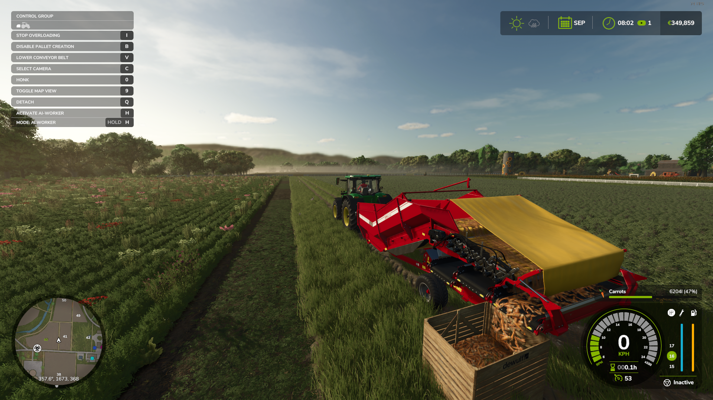
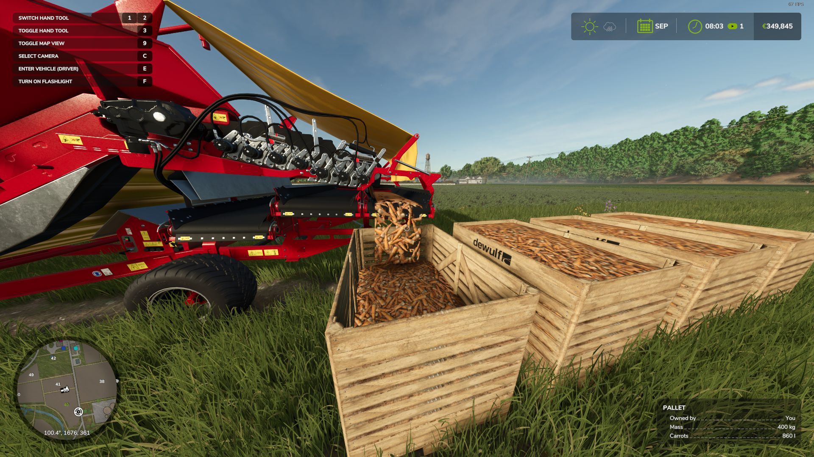

# FS25-Rh2460Plus  

We had small harvesters that could convert carrots into pallets originally, but there was no way to do this when harvesting with a combine (or at least, I don’t know how to, lol).
So, the objective was to edit the existing converter to handle more crop types. All I initially wanted was support for carrots, but I ended up adding parsnips and red beets as well since they were compatible with the original vegetable pallet and could also be harvested with the same combine.

This mod enhances the original RH2460 belt system to process carrots, parsnips, and red beets, converting them into pallets just as it originally does with potatoes.  
The original `fillable` pallet was replaced with a `vegetable` pallet because it looks more realistic.  
The height of the RH2460 was also adjusted to be slightly taller, allowing pallets to fit underneath more easily.  

Here are some images showcasing the changes:  

  

  

  

  

---

### CHANGELOG:
- Adjusted the height of the RH2460.  
- Replaced the original `fillablePallet` with the `vegetablesPallet` for a more realistic appearance.  
- Added support for carrots.  
- Added support for parsnips.  
- Added support for red beets.  
- Optimized the mod size, reducing it from over 10MB to just 1MB.  

